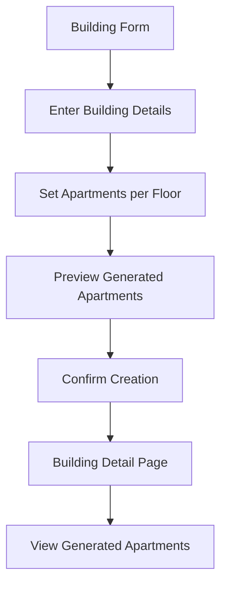

# PRD - Automatsko Generisanje Apartmana

## 1. Product Overview
Funkcionalnost koja omogućava firmama da prilikom kreiranja zgrade automatski definišu i generišu apartmane za sve spratove. Sistem automatski kreira apartmane sa standardizovanim numerisanjem i ubacuje ih u bazu podataka.

Cilj je da se pojednostavi proces upravljanja zgradama tako što će se apartmani automatski kreirati na osnovu broja spratova i definisanog broja apartmana po spratu, eliminirajući potrebu za manuelnim unosom svakog apartmana.

## 2. Core Features

### 2.1 User Roles
| Role | Registration Method | Core Permissions |
|------|---------------------|------------------|
| Company User | Email registracija sa company rolom | Može kreirati zgrade i definisati broj apartmana po spratu |
| Admin | Sistemski admin | Može upravljati svim zgradama i apartmanima |

### 2.2 Feature Module
Naša funkcionalnost se sastoji od sledećih glavnih komponenti:
1. **Forma za kreiranje zgrade**: dodavanje polja za broj apartmana po spratu, automatsko generisanje apartmana
2. **Backend API**: logika za kreiranje apartmana sa standardizovanim numerisanjem
3. **Baza podataka**: čuvanje generisanih apartmana u tabeli apartments

### 2.3 Page Details
| Page Name | Module Name | Feature description |
|-----------|-------------|---------------------|
| Building Form | Apartment Configuration | Dodaje polje "Broj apartmana po spratu" sa validacijom (1-20 apartmana). Prikazuje preview generisanih apartmana pre čuvanja. |
| Building Form | Automatic Generation | Generiše apartmane za sve spratove (garažni nivoi kao negativni spratovi, prizemlje kao 0, spratovi kao pozitivni brojevi). Numerisanje: sprat + slovo (1A, 1B, 2A, 2B, itd.). |
| Backend API | Apartment Creation | Prima podatke o zgradi i broju apartmana po spratu. Kreira apartmane u tabeli apartments sa building_id, apartment_number, floor, osnovnim rooms_config. |

## 3. Core Process
**Company User Flow:**
1. Korisnik otvara formu za kreiranje nove zgrade
2. Unosi osnovne podatke (naziv, adresa, broj spratova, garažni nivoi)
3. Definiše broj apartmana po spratu (novo polje)
4. Sistem prikazuje preview generisanih apartmana
5. Korisnik potvrđuje kreiranje zgrade
6. Sistem automatski kreira zgradu i sve apartmane u bazi
7. Korisnik se preusmerava na detalje zgrade sa listom apartmana

## 4. User Interface Design
### 4.1 Design Style
- Primarni color: #3B82F6 (plavi)
- Sekundarni color: #F3F4F6 (svetlo siva)
- Button style: Zaobljeni dugmići sa hover efektima
- Font: Inter, 14px za osnovni tekst, 16px za labele
- Layout style: Card-based dizajn sa jasno definisanim sekcijama
- Ikone: Lucide React ikone za konzistentnost

### 4.2 Page Design Overview
| Page Name | Module Name | UI Elements |
|-----------|-------------|-------------|
| Building Form | Apartment Configuration | Novo input polje "Broj apartmana po spratu" ispod postojećih polja. Number input sa min=1, max=20. Pomoćni tekst: "Unesite broj apartmana po spratu (1-20)". |
| Building Form | Preview Section | Expandable sekcija "Preview apartmana" sa listom generisanih apartmana grupisanih po spratovima. Format: "Sprat -1: -1A, -1B" / "Prizemlje: 0A, 0B" / "Sprat 1: 1A, 1B". |
| Building Form | Submit Button | Ažuriran tekst dugmeta: "Kreiraj zgradu i apartmane". Loading state: "Kreiranje zgrade i apartmana...". |

### 4.3 Responsiveness
Desktop-first pristup sa mobilnom adaptacijom. Preview sekcija se prilagođava na manjim ekranima sa vertikalnim layoutom umesto horizontalnog.

## 5. Technical Requirements

### 5.1 Database Schema
Postojeća tabela `apartments` se koristi bez izmena:
- `id` (UUID, primary key)
- `building_id` (UUID, foreign key)
- `apartment_number` (VARCHAR(10)) - format: "1A", "2B", "-1A"
- `floor` (INTEGER) - negativni za garaže, 0 za prizemlje, pozitivni za spratove
- `rooms_config` (JSONB) - osnovni config sa default vrednostima
- `created_at` (TIMESTAMP)

### 5.2 Apartment Numbering Logic
- Garažni nivoi: -1A, -1B, -2A, -2B (floor = -1, -2, itd.)
- Prizemlje: 0A, 0B (floor = 0)
- Spratovi: 1A, 1B, 2A, 2B (floor = 1, 2, itd.)
- Slova: A, B, C, D... do maksimalno T (20 apartmana po spratu)

### 5.3 API Endpoint Enhancement
Postojeći POST `/api/buildings` endpoint se proširuje:
- Dodaje se `apartments_per_floor` parametar
- Backend automatski generiše apartmane nakon kreiranja zgrade
- Vraća podatke o zgradi i broju kreiranh apartmana

### 5.4 Validation Rules
- Broj apartmana po spratu: 1-20
- Maksimalno 1000 apartmana po zgradi (spratovi × apartmani po spratu)
- Apartment_number mora biti jedinstven u okviru zgrade
- Floor broj mora odgovarati strukturi zgrade