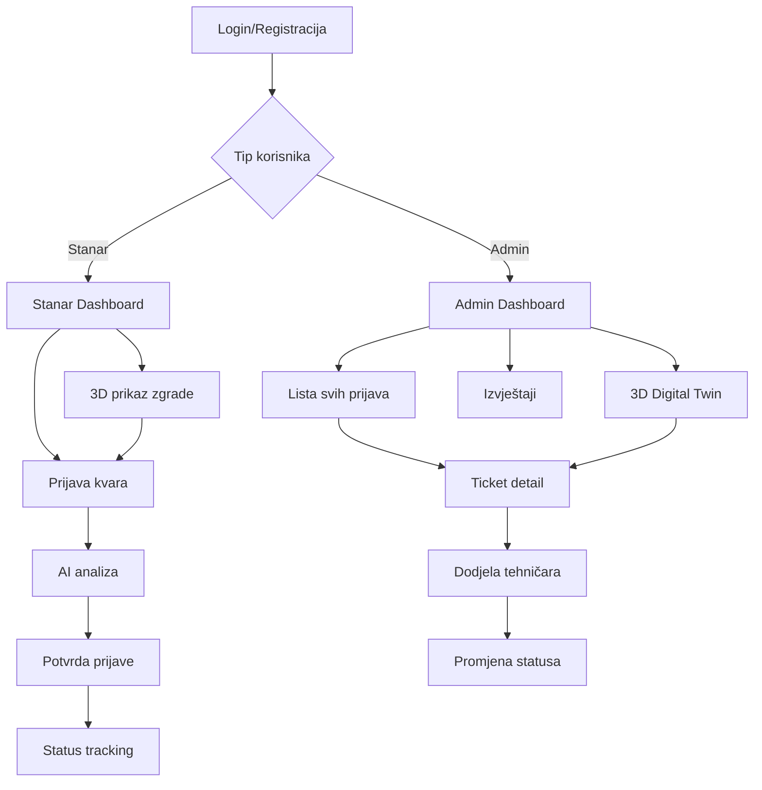

# Product Requirements Document - Kućni Majstor MVP

## 1. Product Overview

Kućni Majstor je inovativna web aplikacija za upravljanje kvarovima u stambenim zgradama koja kombinuje AI tehnologiju i 3D vizualizaciju za efikasniju komunikaciju između stanara i upravnih kompanija.

Aplikacija rješava problem neorganizovane komunikacije oko kvarova u zgradama, omogućavajući stanarima lako prijavljivanje problema uz AI pomoć za kategorizaciju, dok upravnim kompanijama pruža centralizirani dashboard sa 3D pregledom svih prijava.

Cilj je kreirati MVP koji će značajno poboljšati efikasnost održavanja zgrada i zadovoljstvo stanara kroz modernu tehnologiju.

## 2. Core Features

### 2.1 User Roles

| Role | Registration Method | Core Permissions |
|------|---------------------|------------------|
| Stanar | Email ili broj telefona registracija | Može prijaviti kvarove, pratiti status, koristiti AI pomoć i 3D prikaz |
| Admin/Upravna kompanija | Admin kreiranje naloga | Može upravljati svim prijavama, dodijeliti tehničare, koristiti AI analizu i 3D Digital Twin |

### 2.2 Feature Module

Naša aplikacija za upravljanje kvarovima sastoji se od sljedećih glavnih stranica:

1. **Login/Registracija stranica**: autentifikacija korisnika, registracija novih stanara
2. **Dashboard stranica**: pregled aktivnih prijava, brzi pristup funkcionalnostima
3. **Prijava kvara stranica**: kreiranje nove prijave kvara sa AI pomoći
4. **Status tracking stranica**: praćenje statusa postojećih prijava
5. **3D prikaz stranica**: interaktivni 3D model zgrade sa označenim kvarovima
6. **Admin dashboard**: upravljanje svim prijavama, dodjela tehničara, izvještaji
7. **Ticket detail stranica**: detaljni prikaz pojedinačne prijave sa mogućnostima upravljanja

### 2.3 Page Details

| Page Name | Module Name | Feature description |
|-----------|-------------|---------------------|
| Login/Registracija | Autentifikacija | Login sa email/telefon, registracija novih korisnika, password reset |
| Dashboard | Pregled aktivnosti | Prikaz aktivnih prijava, brze statistike, navigacija ka glavnim funkcijama |
| Prijava kvara | Kreiranje prijave | Unos naslova i opisa, odabir kategorije, lokacije, upload fotografije, AI analiza za predlaganje kategorije i prioriteta |
| Status tracking | Praćenje statusa | Lista svih korisnikovih prijava sa trenutnim statusom (Open, Assigned, In Progress, Closed), notifikacije |
| 3D prikaz | Interaktivna vizualizacija | 3D model zgrade/sprata, klik na lokaciju za prijavu kvara, vizuelni prikaz postojećih kvarova |
| Admin dashboard | Upravljanje prijavama | Lista svih prijava, filtriranje po statusu/kategoriji, brze statistike, AI insights |
| Ticket detail | Upravljanje pojedinačnom prijavom | Prikaz svih detalja prijave, promjena statusa, dodjela tehničara, AI sugestije za prioritet |
| Izvještaji | Analitika | Osnovni izvještaji o broju otvorenih/zatvorenih prijava, prosječno vrijeme rješavanja |

## 3. Core Process

**Stanar Flow:**
1. Stanar se registruje/loguje u aplikaciju
2. Kreira novu prijavu kvara unosom detalja i fotografije
3. AI automatski analizira sadržaj i predlaže kategoriju i prioritet
4. Stanar potvrđuje prijavu i može pratiti status kroz dashboard
5. Prima notifikacije kada se status promijeni
6. Može koristiti 3D prikaz za vizuelno označavanje lokacije kvara

**Admin Flow:**
1. Admin se loguje u sistem
2. Vidi sve prijave na dashboard-u sa AI insights
3. Otvara detalje specifične prijave
4. AI predlaže prioritet i tip kvara na osnovu analize
5. Admin dodjeljuje prijavu tehničaru i mijenja status
6. Koristi 3D Digital Twin za vizuelni pregled svih aktivnih kvarova
7. Generiše izvještaje o performansama

## 4. User Interface Design

### 4.1 Design Style

- **Primarne boje**: Plava (#2563EB) za glavne elemente, bijela (#FFFFFF) za pozadinu
- **Sekundarne boje**: Zelena (#10B981) za uspjeh, crvena (#EF4444) za hitne kvarove, žuta (#F59E0B) za upozorenja
- **Button style**: Zaobljeni dugmići sa suptilnim sjenama, hover efekti
- **Font**: Inter ili Roboto, veličine 14px-16px za tekst, 24px-32px za naslove
- **Layout style**: Card-based dizajn sa čistim linijama, top navigation sa sidebar-om za admin
- **Ikone**: Feather ili Heroicons set, minimalistički pristup

### 4.2 Page Design Overview

| Page Name | Module Name | UI Elements |
|-----------|-------------|-------------|
| Login/Registracija | Autentifikacija | Centriran form sa logo-om, input polja sa ikonama, gradient pozadina |
| Dashboard | Pregled aktivnosti | Card layout sa statistikama, lista prijava u tabeli, floating action button za novu prijavu |
| Prijava kvara | Kreiranje prijave | Step-by-step wizard, drag & drop za fotografije, AI suggestions u real-time |
| 3D prikaz | Interaktivna vizualizacija | Full-screen 3D canvas sa kontrolama, overlay sa informacijama o kvarovima |
| Admin dashboard | Upravljanje prijavama | Sidebar navigacija, data table sa filtrima, charts za statistike |
| Ticket detail | Upravljanje prijavom | Split layout - lijevo detalji, desno akcije i komentari |

### 4.3 Responsiveness

Aplikacija je desktop-first sa mobile-adaptive pristupom. Optimizovana za touch interakciju na tablet i mobile uređajima, posebno za upload fotografija i 3D navigaciju.