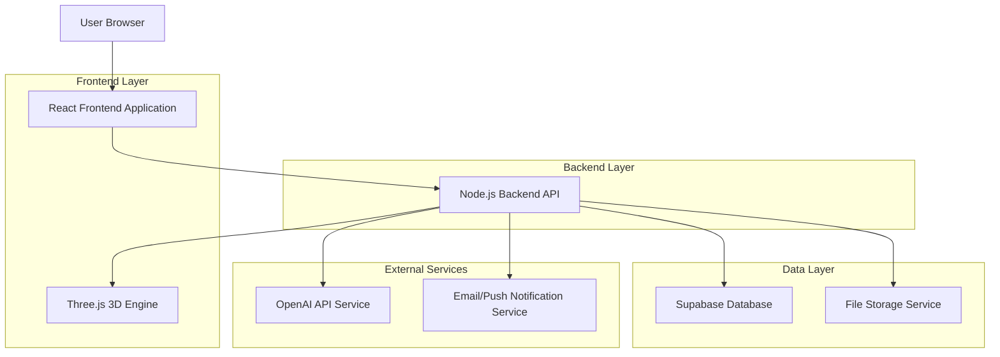
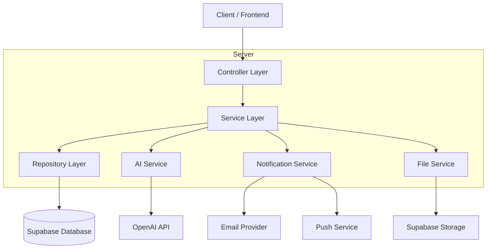
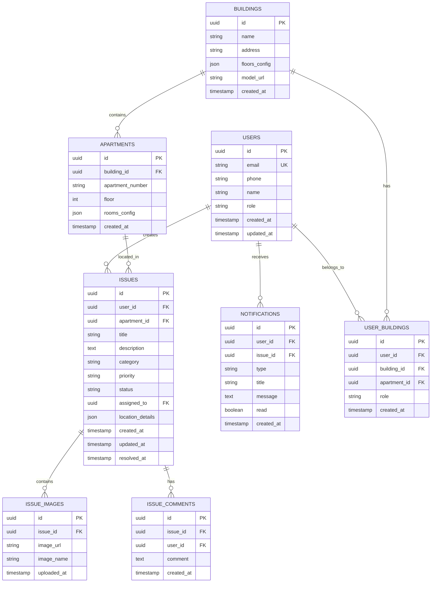

# Technical Architecture Document - Kućni Majstor MVP

## 1. Architecture Design



## 2. Technology Description

- Frontend: React@18 + TypeScript + Tailwind CSS + Vite + Three.js
- Backend: Node.js@18 + Express@4 + TypeScript
- Database: Supabase (PostgreSQL)
- AI Service: OpenAI API (GPT-4 Vision)
- 3D Rendering: Three.js + React Three Fiber
- File Storage: Supabase Storage
- Authentication: Supabase Auth
- Notifications: Web Push API + Email (Resend/SendGrid)

## 3. Route Definitions

| Route | Purpose |
|-------|---------|
| / | Landing page sa osnovnim informacijama |
| /login | Login stranica za sve korisnike |
| /register | Registracija novih stanara |
| /dashboard | Glavni dashboard (različit za stanare i admin) |
| /report-issue | Stranica za prijavu novog kvara |
| /issues | Lista svih korisnikovih prijava |
| /issues/:id | Detaljan prikaz pojedinačne prijave |
| /3d-view | Interaktivni 3D prikaz zgrade |
| /admin/dashboard | Admin dashboard sa svim prijavama |
| /admin/reports | Izvještaji i analitika |
| /admin/users | Upravljanje korisnicima |
| /profile | Korisnički profil i postavke |

## 4. API Definitions

### 4.1 Core API

**Autentifikacija**
```
POST /api/auth/login
```

Request:
| Param Name | Param Type | isRequired | Description |
|------------|------------|------------|-------------|
| email | string | true | Email adresa korisnika |
| password | string | true | Password |

Response:
| Param Name | Param Type | Description |
|------------|------------|-------------|
| success | boolean | Status odgovora |
| user | User | Podaci o korisniku |
| token | string | JWT token |

**Prijava kvara**
```
POST /api/issues
```

Request:
| Param Name | Param Type | isRequired | Description |
|------------|------------|------------|-------------|
| title | string | true | Naslov kvara |
| description | string | true | Opis kvara |
| category | string | false | Kategorija (AI može predložiti) |
| location | object | true | Lokacija (building, floor, apartment, room) |
| images | File[] | false | Fotografije kvara |
| priority | string | false | Prioritet (AI može predložiti) |

Response:
| Param Name | Param Type | Description |
|------------|------------|-------------|
| success | boolean | Status odgovora |
| issue | Issue | Kreirana prijava |
| aiSuggestions | object | AI predlozi za kategoriju i prioritet |

**AI analiza**
```
POST /api/ai/analyze-issue
```

Request:
| Param Name | Param Type | isRequired | Description |
|------------|------------|------------|-------------|
| description | string | true | Opis kvara |
| images | string[] | false | Base64 encoded slike |

Response:
| Param Name | Param Type | Description |
|------------|------------|-------------|
| suggestedCategory | string | Predložena kategorija |
| suggestedPriority | string | Predloženi prioritet |
| confidence | number | Nivo pouzdanosti AI-ja |

**Status update**
```
PATCH /api/issues/:id/status
```

Request:
| Param Name | Param Type | isRequired | Description |
|------------|------------|------------|-------------|
| status | string | true | Novi status (open, assigned, in_progress, closed) |
| assignedTo | string | false | ID tehničara |
| notes | string | false | Napomene |

## 5. Server Architecture Diagram



## 6. Data Model

### 6.1 Data Model Definition



### 6.2 Data Definition Language

**Users Table**
```sql
-- Create users table
CREATE TABLE users (
    id UUID PRIMARY KEY DEFAULT gen_random_uuid(),
    email VARCHAR(255) UNIQUE NOT NULL,
    phone VARCHAR(20),
    name VARCHAR(100) NOT NULL,
    role VARCHAR(20) DEFAULT 'tenant' CHECK (role IN ('tenant', 'admin', 'technician')),
    created_at TIMESTAMP WITH TIME ZONE DEFAULT NOW(),
    updated_at TIMESTAMP WITH TIME ZONE DEFAULT NOW()
);

-- Create buildings table
CREATE TABLE buildings (
    id UUID PRIMARY KEY DEFAULT gen_random_uuid(),
    name VARCHAR(255) NOT NULL,
    address TEXT NOT NULL,
    floors_config JSONB,
    model_url VARCHAR(500),
    created_at TIMESTAMP WITH TIME ZONE DEFAULT NOW()
);

-- Create apartments table
CREATE TABLE apartments (
    id UUID PRIMARY KEY DEFAULT gen_random_uuid(),
    building_id UUID REFERENCES buildings(id) ON DELETE CASCADE,
    apartment_number VARCHAR(10) NOT NULL,
    floor INTEGER NOT NULL,
    rooms_config JSONB,
    created_at TIMESTAMP WITH TIME ZONE DEFAULT NOW()
);

-- Create issues table
CREATE TABLE issues (
    id UUID PRIMARY KEY DEFAULT gen_random_uuid(),
    user_id UUID REFERENCES users(id) ON DELETE CASCADE,
    apartment_id UUID REFERENCES apartments(id) ON DELETE CASCADE,
    title VARCHAR(255) NOT NULL,
    description TEXT NOT NULL,
    category VARCHAR(50),
    priority VARCHAR(20) DEFAULT 'medium' CHECK (priority IN ('low', 'medium', 'high', 'urgent')),
    status VARCHAR(20) DEFAULT 'open' CHECK (status IN ('open', 'assigned', 'in_progress', 'closed')),
    assigned_to UUID REFERENCES users(id),
    location_details JSONB,
    created_at TIMESTAMP WITH TIME ZONE DEFAULT NOW(),
    updated_at TIMESTAMP WITH TIME ZONE DEFAULT NOW(),
    resolved_at TIMESTAMP WITH TIME ZONE
);

-- Create issue_images table
CREATE TABLE issue_images (
    id UUID PRIMARY KEY DEFAULT gen_random_uuid(),
    issue_id UUID REFERENCES issues(id) ON DELETE CASCADE,
    image_url VARCHAR(500) NOT NULL,
    image_name VARCHAR(255),
    uploaded_at TIMESTAMP WITH TIME ZONE DEFAULT NOW()
);

-- Create issue_comments table
CREATE TABLE issue_comments (
    id UUID PRIMARY KEY DEFAULT gen_random_uuid(),
    issue_id UUID REFERENCES issues(id) ON DELETE CASCADE,
    user_id UUID REFERENCES users(id) ON DELETE CASCADE,
    comment TEXT NOT NULL,
    created_at TIMESTAMP WITH TIME ZONE DEFAULT NOW()
);

-- Create notifications table
CREATE TABLE notifications (
    id UUID PRIMARY KEY DEFAULT gen_random_uuid(),
    user_id UUID REFERENCES users(id) ON DELETE CASCADE,
    issue_id UUID REFERENCES issues(id) ON DELETE CASCADE,
    type VARCHAR(50) NOT NULL,
    title VARCHAR(255) NOT NULL,
    message TEXT NOT NULL,
    read BOOLEAN DEFAULT FALSE,
    created_at TIMESTAMP WITH TIME ZONE DEFAULT NOW()
);

-- Create user_buildings table
CREATE TABLE user_buildings (
    id UUID PRIMARY KEY DEFAULT gen_random_uuid(),
    user_id UUID REFERENCES users(id) ON DELETE CASCADE,
    building_id UUID REFERENCES buildings(id) ON DELETE CASCADE,
    apartment_id UUID REFERENCES apartments(id) ON DELETE CASCADE,
    role VARCHAR(20) DEFAULT 'resident',
    created_at TIMESTAMP WITH TIME ZONE DEFAULT NOW()
);

-- Create indexes
CREATE INDEX idx_issues_user_id ON issues(user_id);
CREATE INDEX idx_issues_status ON issues(status);
CREATE INDEX idx_issues_created_at ON issues(created_at DESC);
CREATE INDEX idx_issues_priority ON issues(priority);
CREATE INDEX idx_notifications_user_id ON notifications(user_id);
CREATE INDEX idx_notifications_read ON notifications(read);

-- Grant permissions for Supabase
GRANT SELECT ON ALL TABLES IN SCHEMA public TO anon;
GRANT ALL PRIVILEGES ON ALL TABLES IN SCHEMA public TO authenticated;

-- Initial data
INSERT INTO buildings (name, address, floors_config) VALUES 
('Zgrada A', 'Bulevar Oslobođenja 123, Novi Sad', '{"floors": 5, "apartments_per_floor": 4}'),
('Zgrada B', 'Zmaj Jovina 45, Novi Sad', '{"floors": 3, "apartments_per_floor": 6}');

INSERT INTO apartments (building_id, apartment_number, floor, rooms_config) 
SELECT 
    (SELECT id FROM buildings WHERE name = 'Zgrada A'),
    CONCAT(floor_num, LPAD(apt_num::text, 2, '0')),
    floor_num,
    '{"rooms": ["living_room", "bedroom", "kitchen", "bathroom"]}'
FROM generate_series(1, 5) AS floor_num,
     generate_series(1, 4) AS apt_num;
```