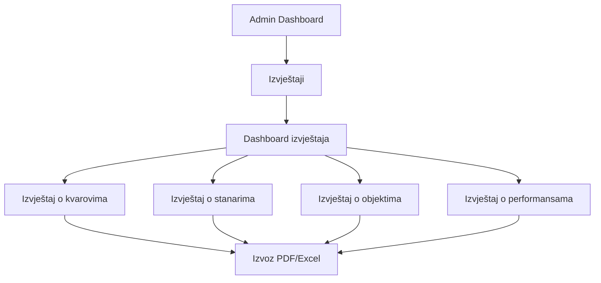

# Zahtjevi za dodavanje izvještaja u navigaciju

## 1. Pregled proizvoda
Aplikacija "Kućni Majstor" je sistem za upravljanje kvarovima u stambenim objektima koji omogućava stanarima da prijavljuju kvarove, a firmama (admin/company korisnicima) da ih prate i rješavaju. Dodavanje izvještaja će omogućiti firmama bolje praćenje performansi i donošenje informiranih odluka.

## 2. Osnovne funkcionalnosti

### 2.1 Korisničke uloge
| Uloga | Metoda registracije | Osnovne dozvole |
|-------|---------------------|-----------------|
| Stanar | Email registracija | Može prijaviti kvar, pratiti svoje kvarove |
| Admin/Company | Pozivni kod ili admin dodjela | Može pristupiti svim izvještajima, upravljati objektima i stanarima |

### 2.2 Modul funkcionalnosti
Naši zahtjevi za izvještaje sastoje se od sljedećih glavnih stranica:
1. **Izvještaji Dashboard**: pregled svih dostupnih izvještaja, brze statistike
2. **Izvještaj o kvarovima**: detaljni prikaz kvarova po različitim kriterijima
3. **Izvještaj o stanarima**: statistike o stanarima i njihovoj aktivnosti
4. **Izvještaj o objektima**: performanse i statistike po objektima
5. **Izvještaj o performansama**: analiza efikasnosti rješavanja kvarova

### 2.3 Detalji stranica

| Naziv stranice | Naziv modula | Opis funkcionalnosti |
|----------------|--------------|----------------------|
| Izvještaji Dashboard | Pregled izvještaja | Prikaži brze statistike, linkove na detaljne izvještaje, grafike trendova |
| Izvještaj o kvarovima | Filtriranje kvarova | Filtriraj po statusu, prioritetu, kategoriji, vremenskom periodu. Prikaži tabelu i grafike |
| Izvještaj o stanarima | Statistike stanara | Prikaži broj stanara po objektu, aktivnost prijavljenih kvarova, top korisnici |
| Izvještaj o objektima | Performanse objekata | Statistike po objektu, najčešći kvarovi, troškovi održavanja |
| Izvještaj o performansama | Analiza efikasnosti | Vrijeme rješavanja kvarova, prosječno vrijeme odgovora, zadovoljstvo stanara |

## 3. Osnovni proces
Admin/Company korisnik pristupa izvještajima kroz lijevu navigaciju:
1. Klikne na "Izvještaji" u lijevoj navigaciji (ispod "Stanari")
2. Otvara se Dashboard sa pregledom svih izvještaja
3. Odabira specifičan izvještaj
4. Postavlja filtere i parametre
5. Pregledava rezultate u tabeli ili grafiku
6. Izvozi podatke u PDF ili Excel format

## 4. Dizajn korisničkog interfejsa

### 4.1 Stil dizajna
- Primarne boje: Plava (#3B82F6), Bijela (#FFFFFF)
- Sekundarne boje: Siva (#6B7280), Zelena (#10B981) za pozitivne metrike
- Stil dugmića: Zaobljeni (rounded-md), sa hover efektima
- Font: System font stack, veličine 14px-24px
- Stil layouta: Card-based dizajn, top navigacija sa breadcrumbs
- Ikone: Lucide React ikone (BarChart3, FileText, TrendingUp)

### 4.2 Pregled dizajna stranica

| Naziv stranice | Naziv modula | UI elementi |
|----------------|--------------|-------------|
| Izvještaji Dashboard | Pregled kartice | 4 glavne kartice sa ikonama, brze statistike, mini grafici |
| Izvještaj o kvarovima | Filter panel | Dropdown meniji za filtere, tabela sa sortiranjem, bar/line grafici |
| Izvještaj o stanarima | Statistike tabela | Tabela sa paginacijom, pie chart za distribuciju |
| Izvještaj o objektima | Objekti grid | Grid layout sa karticama objekata, progress barovi |
| Izvještaj o performansama | Metrike dashboard | KPI kartice, line grafici za trendove, gauge komponente |

### 4.3 Responzivnost
Aplikacija je desktop-first sa mobile-adaptive pristupom. Tabele se transformišu u kartice na manjim ekranima, grafici se skaliraju, a navigacija postaje hamburger meni.