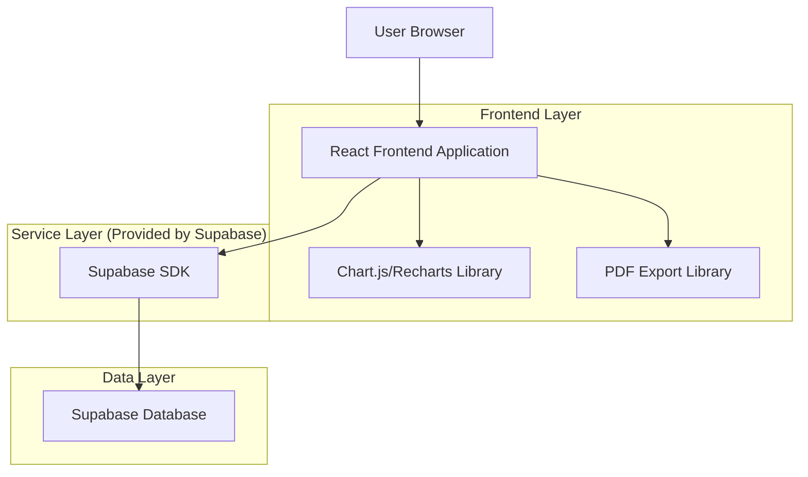
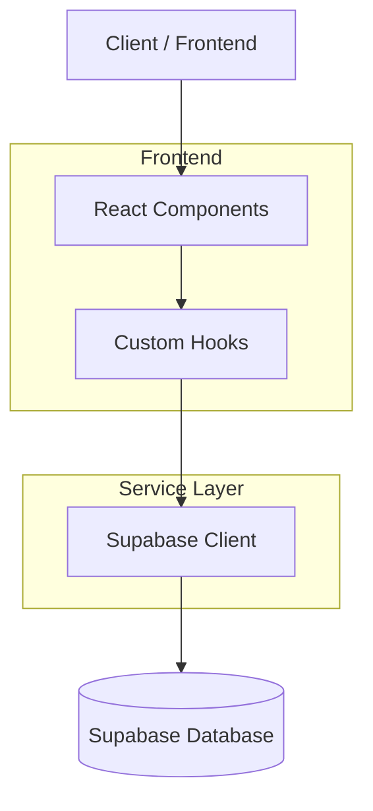
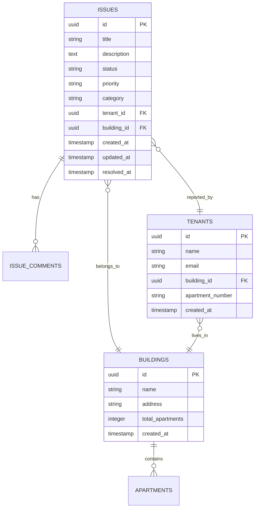

# Tehnička arhitektura za izvještaje

## 1. Dizajn arhitekture



## 2. Opis tehnologija
- Frontend: React@18 + TypeScript + TailwindCSS@3 + Vite
- Backend: Supabase (PostgreSQL database, Auth, RLS)
- Grafici: Recharts ili Chart.js
- Izvoz: jsPDF + html2canvas za PDF, xlsx za Excel
- Ikone: Lucide React

## 3. Definicije ruta

| Ruta | Svrha |
|------|-------|
| /reports | Dashboard izvještaja, pregled svih dostupnih izvještaja |
| /reports/issues | Detaljni izvještaj o kvarovima sa filterima |
| /reports/tenants | Izvještaj o stanarima i njihovoj aktivnosti |
| /reports/buildings | Izvještaj o performansama objekata |
| /reports/performance | Izvještaj o efikasnosti rješavanja kvarova |

## 4. API definicije

### 4.1 Osnovni API

Izvještaj o kvarovima
```
GET /api/reports/issues
```

Zahtjev:
| Naziv parametra | Tip parametra | Obavezan | Opis |
|-----------------|---------------|----------|------|
| startDate | string | false | Početni datum (ISO format) |
| endDate | string | false | Krajnji datum (ISO format) |
| status | string | false | Status kvarova (pending, open, in_progress, resolved) |
| priority | string | false | Prioritet (low, medium, high, urgent) |
| buildingId | string | false | ID objekta |

Odgovor:
| Naziv parametra | Tip parametra | Opis |
|-----------------|---------------|------|
| issues | Issue[] | Lista kvarova |
| totalCount | number | Ukupan broj kvarova |
| statusBreakdown | object | Broj kvarova po statusu |
| priorityBreakdown | object | Broj kvarova po prioritetu |

Primjer:
```json
{
  "issues": [
    {
      "id": "123",
      "title": "Kvar na vodovodnoj cijevi",
      "status": "resolved",
      "priority": "high",
      "created_at": "2024-01-15T10:00:00Z",
      "resolved_at": "2024-01-16T14:30:00Z"
    }
  ],
  "totalCount": 150,
  "statusBreakdown": {
    "pending": 10,
    "open": 25,
    "in_progress": 15,
    "resolved": 100
  }
}
```

## 5. Arhitektura servera



## 6. Model podataka

### 6.1 Definicija modela podataka



### 6.2 Data Definition Language

Tabela za praćenje izvještaja (reports_cache)
```sql
-- kreiranje tabele za keširanje izvještaja
CREATE TABLE reports_cache (
    id UUID PRIMARY KEY DEFAULT gen_random_uuid(),
    report_type VARCHAR(50) NOT NULL,
    parameters JSONB NOT NULL,
    data JSONB NOT NULL,
    created_at TIMESTAMP WITH TIME ZONE DEFAULT NOW(),
    expires_at TIMESTAMP WITH TIME ZONE DEFAULT NOW() + INTERVAL '1 hour'
);

-- kreiranje indeksa
CREATE INDEX idx_reports_cache_type ON reports_cache(report_type);
CREATE INDEX idx_reports_cache_expires ON reports_cache(expires_at);

-- RLS politike
ALTER TABLE reports_cache ENABLE ROW LEVEL SECURITY;

-- Dozvoli pristup samo admin/company korisnicima
CREATE POLICY "Admin can access reports cache" ON reports_cache
    FOR ALL USING (
        auth.jwt() ->> 'role' = 'admin' OR 
        auth.jwt() ->> 'role' = 'company' OR
        (auth.jwt() -> 'app_metadata' ->> 'role') = 'admin' OR
        (auth.jwt() -> 'app_metadata' ->> 'role') = 'company'
    );

-- Funkcija za čišćenje starih keš podataka
CREATE OR REPLACE FUNCTION cleanup_expired_reports()
RETURNS void AS $$
BEGIN
    DELETE FROM reports_cache WHERE expires_at < NOW();
END;
$$ LANGUAGE plpgsql;

-- Kreiranje scheduled job-a (ako je dostupan pg_cron)
-- SELECT cron.schedule('cleanup-reports', '0 * * * *', 'SELECT cleanup_expired_reports();');
```

Pogledi za izvještaje
```sql
-- Pogled za statistike kvarova
CREATE VIEW issues_stats AS
SELECT 
    DATE_TRUNC('month', created_at) as month,
    status,
    priority,
    category,
    building_id,
    COUNT(*) as count,
    AVG(EXTRACT(EPOCH FROM (resolved_at - created_at))/3600) as avg_resolution_hours
FROM issues 
GROUP BY DATE_TRUNC('month', created_at), status, priority, category, building_id;

-- Pogled za statistike stanara
CREATE VIEW tenant_stats AS
SELECT 
    t.building_id,
    COUNT(DISTINCT t.id) as total_tenants,
    COUNT(i.id) as total_issues,
    AVG(CASE WHEN i.id IS NOT NULL THEN 1 ELSE 0 END) as avg_issues_per_tenant
FROM tenants t
LEFT JOIN issues i ON t.id = i.tenant_id
GROUP BY t.building_id;

-- Dozvoli pristup pogledima
GRANT SELECT ON issues_stats TO authenticated;
GRANT SELECT ON tenant_stats TO authenticated;
```